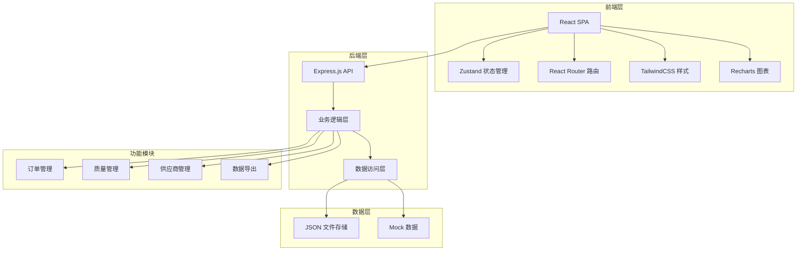
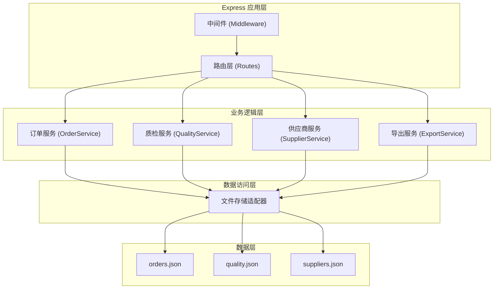
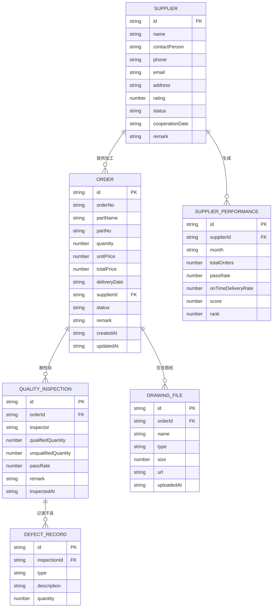

## 1. 架构设计

本系统采用前后端分离架构，前端使用React + TypeScript构建单页应用，后端使用Express.js提供RESTful API服务，数据存储采用文件型数据库便于部署和迁移。



## 2. 技术说明

- **前端框架**：React@18 + TypeScript
- **构建工具**：Vite
- **路由管理**：react-router-dom
- **状态管理**：zustand
- **样式方案**：tailwindcss@3
- **图标库**：lucide-react
- **图表库**：recharts
- **UI组件**：自定义组件（基于TailwindCSS）
- **后端框架**：Express@4
- **数据存储**：JSON文件存储（便于快速开发和演示）
- **Excel导出**：xlsx (SheetJS)
- **文件上传**：express-fileupload

## 3. 路由定义

| 路由路径 | 页面名称 | 说明 |
|----------|----------|------|
| /dashboard | 工作台仪表盘 | 数据概览、待办事项、质量趋势 |
| /orders | 外协订单列表 | 订单列表展示、筛选、搜索 |
| /orders/new | 创建外协订单 | 新建订单表单、图纸上传 |
| /orders/:id | 订单详情 | 订单信息、时间线、质检记录 |
| /quality | 质量检验 | 待质检订单列表、质检录入 |
| /suppliers | 供应商管理 | 供应商列表、档案信息 |
| /suppliers/performance | 供应商绩效 | 月度评价、排名榜单、不良分布 |
| /settings | 系统设置 | 不良原因配置、参数设置 |

## 4. API 接口定义

### 4.1 订单管理接口

```typescript
// 订单类型定义
interface Order {
  id: string;
  orderNo: string;
  partName: string;
  partNo: string;
  quantity: number;
  unitPrice: number;
  totalPrice: number;
  deliveryDate: string;
  supplierId: string;
  supplierName: string;
  drawings: DrawingFile[];
  status: 'pending' | 'processing' | 'inspecting' | 'completed' | 'rejected';
  remark: string;
  createdAt: string;
  updatedAt: string;
}

interface DrawingFile {
  id: string;
  name: string;
  type: string;
  size: number;
  url: string;
  uploadedAt: string;
}

// 接口列表
GET    /api/orders              // 获取订单列表（支持分页、筛选）
GET    /api/orders/:id          // 获取订单详情
POST   /api/orders              // 创建订单
PUT    /api/orders/:id          // 更新订单
DELETE /api/orders/:id          // 删除订单
POST   /api/orders/:id/drawings // 上传图纸
```

### 4.2 质检管理接口

```typescript
interface QualityInspection {
  id: string;
  orderId: string;
  orderNo: string;
  inspector: string;
  qualifiedQuantity: number;
  unqualifiedQuantity: number;
  passRate: number;
  defects: DefectRecord[];
  remark: string;
  inspectedAt: string;
}

interface DefectRecord {
  id: string;
  type: string;
  description: string;
  quantity: number;
}

// 接口列表
GET    /api/quality                     // 获取质检列表
GET    /api/quality/:id                 // 获取质检详情
POST   /api/quality                     // 创建质检记录
GET    /api/quality/defect-types        // 获取不良原因类型列表
GET    /api/quality/trends?days=30      // 获取质量趋势数据
```

### 4.3 供应商管理接口

```typescript
interface Supplier {
  id: string;
  name: string;
  contactPerson: string;
  phone: string;
  email: string;
  address: string;
  rating: number;
  status: 'active' | 'inactive';
  cooperationDate: string;
  remark: string;
}

interface SupplierPerformance {
  supplierId: string;
  supplierName: string;
  month: string;
  totalOrders: number;
  passRate: number;
  onTimeDeliveryRate: number;
  score: number;
  rank: number;
  defectDistribution: { type: string; count: number }[];
}

// 接口列表
GET    /api/suppliers                  // 获取供应商列表
GET    /api/suppliers/:id              // 获取供应商详情
POST   /api/suppliers                  // 新增供应商
PUT    /api/suppliers/:id              // 更新供应商
GET    /api/suppliers/performance      // 获取供应商绩效排名
GET    /api/suppliers/:id/performance  // 获取单个供应商绩效详情
```

### 4.4 数据导出接口

```typescript
GET /api/export/orders?format=xlsx     // 导出订单明细
GET /api/export/suppliers/ranking      // 导出供应商质量排行榜
```

## 5. 后端架构图



## 6. 数据模型

### 6.1 实体关系图



### 6.2 数据文件结构

数据以JSON文件形式存储在 `api/data/` 目录下：

- `orders.json` - 外协订单数据
- `suppliers.json` - 供应商数据
- `quality.json` - 质检记录数据
- `defectTypes.json` - 不良原因类型配置
- `users.json` - 用户数据

### 6.3 初始数据

系统预置以下Mock数据：
- 5家供应商（不同评级）
- 20个外协订单（覆盖不同状态）
- 15条质检记录
- 8种不良原因类型（尺寸超差、外观瑕疵、材料不符、硬度不够、表面粗糙度、形位公差、热处理不合格、其他）
